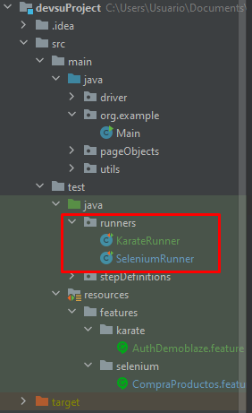

# Devsu LLC Technical Assessment

### Implementación:
1. Clonar el proyecto con el comando:
`git clone https://github.com/DimaxQp/devsuProject.git`
2.  Instalar JDK 20 Oracle desde la URL:
https://www.oracle.com/java/technologies/javase/jdk20-archive-downloads.html
3. Importar JDK a Intellij IDEA:
   - Click en File
   - Click en Project Structure
   - Seleccionar el JDK instalado en el campo SDK
4. Instalar y configurar Maven desde el siguiente enlace: 
https://maven.apache.org/download.cgi

### Ejecución:
- #### Para E2E:
1. Ejecutar clase SeleniumRunner.java, ubicado en "src/test/java/runners/SeleniumRunner.java"

- #### Para API:
  Ejecutar clase KarateRunner.java, ubicado en "src/test/java/runners/KarateRunner.java" o ejecutar comando `mvn test -Dtest=KarateRunner` desde el terminal

### Reporte de ejecución:

- #### Para E2E:
  - Abrir acceso directo **selenium-report.html**
  - Archivo original ubicado en "../devsuProject/target"

- #### Para API:
  - Abrir acceso directo karate-report.html
  - Archivo original ubicado en "../devsuProject/target/karate-reports"